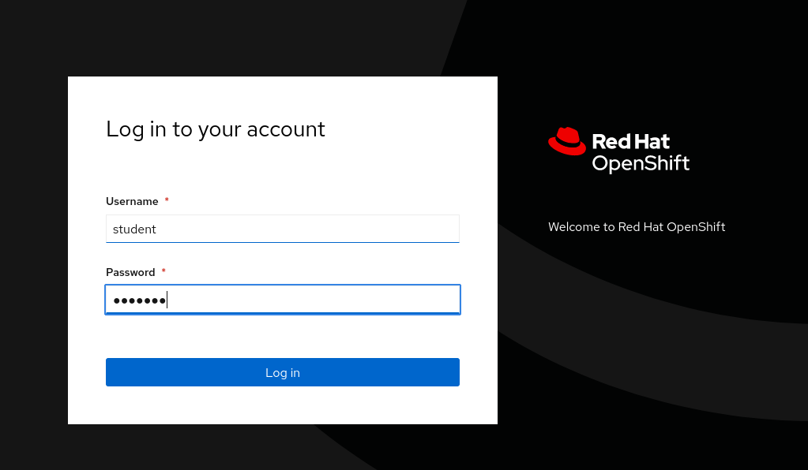
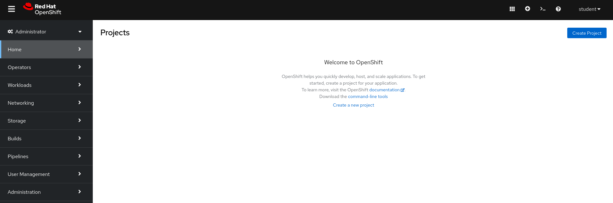
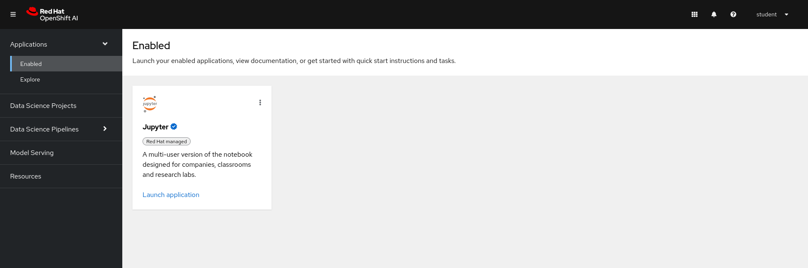
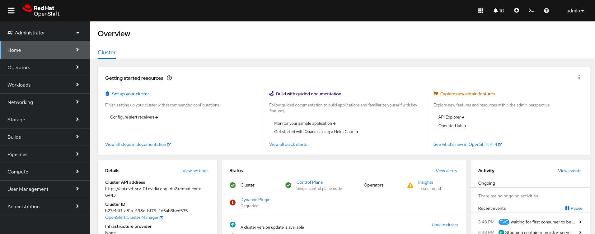
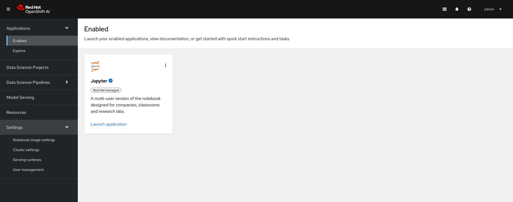

# quick-add-settings-tab-rhoai
Quick Instructions to add user for RHO-AI. If you need to access the "settings" sidebar.

Certainly! Here is a complete step-by-step guide for adding `admin` and `student` users with HTPasswd authentication on an OpenShift cluster:

1. **Create or Update the HTPasswd File**:
   - If you're creating a new HTPasswd file:
     ```sh
     htpasswd -c -B -b users.htpasswd admin <password>
     htpasswd -B -b users.htpasswd student <password>
     ```
   - If you're updating an existing HTPasswd file:
     ```sh
     htpasswd -B -b users.htpasswd admin <password>
     htpasswd -B -b users.htpasswd student <password>
     ```

2. **Create or Update the Secret in OpenShift**:
   - If creating a new secret for HTPasswd authentication:
     ```sh
     oc create secret generic htpasswd-secret --from-file=htpasswd=users.htpasswd -n openshift-config
     ```
   - If updating an existing HTPasswd secret:
     ```sh
     oc set data secret/htpasswd-secret --from-file=htpasswd=users.htpasswd -n openshift-config
     ```

3. **Configure the OAuth Cluster**:
   - If you haven't already configured HTPasswd as the identity provider in your OAuth cluster settings, you will need to configure it. Update the OAuth cluster configuration with the name of your secret (`htpasswd-secret` in this case):

     ```yaml
     apiVersion: config.openshift.io/v1
     kind: OAuth
     metadata:
       name: cluster
     spec:
       identityProviders:
       - name: htpasswd_provider
         challenge: true
         login: true
         mappingMethod: claim
         type: HTPasswd
         htpasswd:
           fileData:
             name: htpasswd-secret
     ```

     Apply the configuration using `oc apply -f <filename>.yaml`.

4. **Log in as the New Users**:
   - Attempt to log in as `admin` and `student` to verify the credentials work and to create the user objects in OpenShift:
     ```sh
     oc login -u admin -p <password>
     oc login -u student -p <password>
     ```

5. **Assign Roles**:
   - If you want `admin` to have cluster-admin privileges, run:
     ```sh
     oc adm policy add-cluster-role-to-user cluster-admin admin
     ```
   - If you want `student` to have specific permissions, run:
     ```sh
     oc adm policy add-role-to-user edit student -n myproject
     ```

6. **Verify User Creation and Role Assignment**:
   - Use `oc describe user` to verify the user has been created and roles are assigned:
     ```sh
     oc describe user admin
     oc describe user student
     ```


# Reference: 

## Images for Reference:

Login:





Click on # in the top right, It looks like a waffle.


You won't see settings because you are a basic user.



Logout and try "admin"




RHO-AI Login


Settings are now visable:




# Logs

## **oc describe user admin**

```bash
$ oc describe user admin
oc describe user student
Name:		admin
Created:	9 minutes ago
Labels:		<none>
Annotations:	<none>
Identities:	htpasswd_provider:admin
Name:		student
Created:	25 minutes ago
Labels:		<none>
Annotations:	<none>
Identities:	htpasswd_provider:student
```